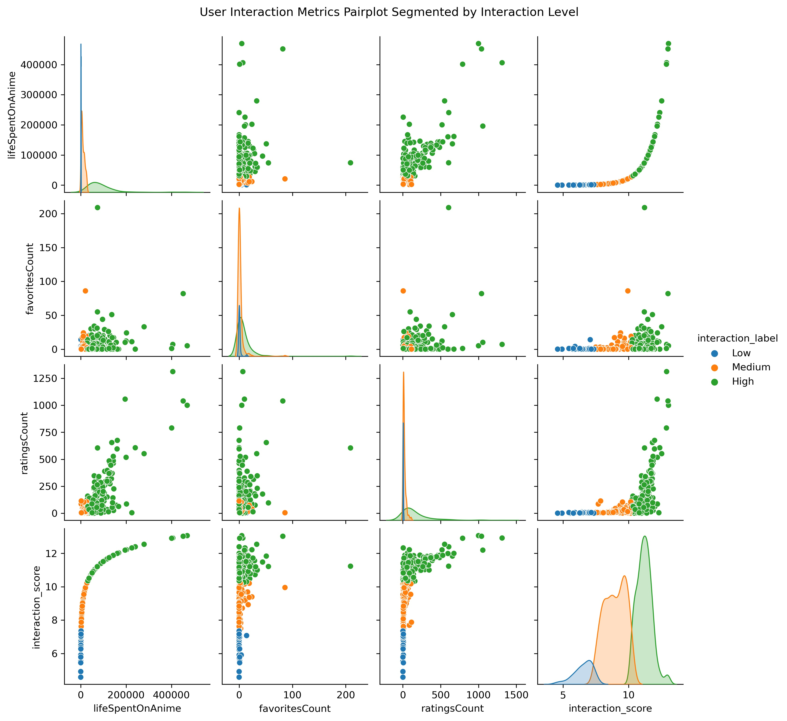
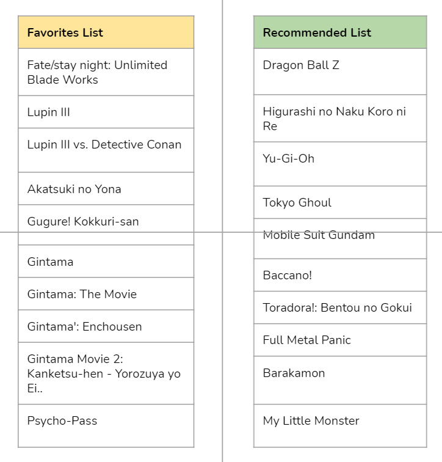

# Personalized Anime Recommendation Engine - Collaborative Filtering Using Implicit Feedback Data to Provide Better Anime Recommendations


**Author**: Melvin Garcia

## Overview

Tastyroll is one of the largest anime streaming platforms on the internet. With their ever growing anime catalog, and increasing number of users, making the right anime recommendations to keep old and new users engaged is important more than ever. Tastyroll has reached the growth stage of their company where there is a needed shift in how recommendations are made with less reliance on recommendation systems based on content-based filtering, and collaborative filtering for explicit feedback data. 

## Business Problem

While the most common method to providing recommendations are through the explicit ratings users provide (ie based on an 'enjoyment' score 1-5; 1-5 stars etc.), collecting and analyzing ratings data is very scarce. Based on the data, it appears most of the time, users do not provide ratings at all, and with the increasing number of anime and users, providing meaningful recommendations solely on this method does not scale. What Tastyroll does have in abundance is 'interaction' or implicit data -- that is data around whether a user has watched something, in the middle of watching, plan to watch, favorited, or even commented on something. 

These data inputs are much more passive from a user's perspective, hence the quantity of implicit data far outweighs the amount of explicit data Tastyroll has. Therefore, in this project Tastyroll has tasked its team of data scientists to take advantage this implicit data and design a more robust recommender system.

## Data

Tastyroll's user-anime implicit feedback data is query-able from the Kitsu API (https://kitsu.docs.apiary.io/). At a high level, there are 2-3 levels in how we would like to make requests to the Kitsu API. 

1. Make requests to retrieve user data. Within this user data, we are able to obtain data points such as:
- Time spent watching anime
- Comments count
- Favorites count
- Likes given count
- Reviews count

Based on these data points, this will inform of some medium-high activity users we can test our recommendation model on.

2. Make requests to retrieve user-anime interaction data. The requests to these API endpoints will make up the bulk of our dataset to set up our recommendation system. For the scope of this initial project, we will explore 2 aspects of interaction data:
- Anime users have favorited. We will use this an indication that a user has a strong tie / engagement with an anime.
- The user's 'watch status' over an anime. Watch statuses outlined by the Kitsu API include:
    - Completed
    - In progress
    - On hold
    - Dropped
Altogether, we will use the watch status to inform our model of the varying degrees of engagement / interaction with an anime -- with having completed an anime as having a high interaction strength versus dropping an anime, having a low interaction strength.

3. Lastly, based anime users have favorited and their watch status, we will set up dictionary to associate a weight or strength to say that a user's action to *favorite* or *complete* is much stronger than *dropping* or putting it *on hold*. 

For the scope of this project, we will also focus on analyzing / making recommendations for the top 5 active users.

## Methods

The steps below outline how we will approach creating and iterating on our collaborative filter and content-based recommendation model to later build up our hybrid model.

1. Data Collection and Preprocessing
2. Collaborative Filter Model Exploration and Iteration
3. Hypertuning and Final Model Evaluation

**Prepare & Explore the Data**

In this section we will aim to pull an initial sample of ~500 users and their interaction data.

In total, there are 1,182,501 users and through the API, we are able to traverse through 20 results at a time (as the JSON responses are paginated). If we traverse through all 1.1M users only 20 at a time, we will need to make 59,125 iterations. 

For the purposes of this initial project, we will pull a sample of 5,000 random users only needing 250 iterations.

For the list of users we've extracted data on, we will aim to look at users with medium - high activity based on the following metrics:
- Time spent watching anime
- Comments count
- Favorites count
- Likes given count
- Reviews count

From this evaluation, we will create functions to uniquely extract the data points of interest from the *favorites* and *library entries* endpoints so that we can format the results into a pandas dataframe for downstream analysis. Below are high level descriptions of the API endpoints we are interested in.

1. The Favorites API endpoint is a bit more self-explanatory, where if a user simply enjoys / enjoyed or wants to actively save an anime for their record, the common interaction is to *favorite* that anime.

2. Library Entries is an interesting API endpoint to look at as it gives us data on the viewing history, and to what extent a user has watched an anime.

**Initial Alternating Least Squares Model**

We will focus on using the Alternating Least Square algorithm to handle our implicit feedback.  It is one of the most common, yet effective methods when creating a recommender system based on implicit data.

In our case, we will use the python implicit library found here: https://implicit.readthedocs.io/en/latest/als.html

After setting up an initial model, we will the AUC score as an initial metric for modeling: https://stats.stackexchange.com/questions/68893/area-under-curve-of-roc-vs-overall-accuracy

We set aside 20% of our data for testing and evaluating our recommender system. We will need to see if the order of anime recommendations end up being anime the user eventually interacted with (favorited, completed, in progress etc).

We will also use a function imported called 'calc_mean_auc' which will calculate the AUC for the most popular anime to compare the anime our user actually interacted with. 

Lastly, we will provide our own qualitative evaluation by looking up the anime a user has actually interacted with and make comparisons to the recommendations our model has output. For example, does it make sense to recommend slice-of-life, romantic comedy anime, if a user has only previously interacted with shonen action type of anime?

**Hypertuning and Final Model Evaluation**

In this last step, will perform our own gridsearch to sift through different combinations of parameters to feed into our implicit alternating least squares model. While iterating over the different combinations of parameters, we will track 2 evaluation metrics: 1) precision at k (p at k) 2) mean average precision at k (map at k). Essentially, these metrics will provide a numeric assessment of how many of our recommendation are 'relevant' the the topN recommendations for a user. 

Precision@k = (# of recommended items @k that are relevant) / (# of recommended items @k)

We will use the parameters associated with either the highest p at k or map at k metrics to create our final model.

## Results

### Collaborative Filter Model Comparison

The visual above showcases how our segmenting efforts distribute and correlated with the user metrics of interest: lifeSpentOnAnime, favoritesCount, and ratingsCount. Based on this pairplot visual, it is worth noting that lifeSpentOnAnime and ratingsCount appear to have the most linear (although not perfect) relationship amongst these features. Perhaps the more a user spends watching anime, they are more inclined to provide a rating as well as opposed to favoriting an anime. Moreover, lifeSpentonAnime appears to have an extreme right skew -- by taking the log and adding a weightage to favorites and ratings counts, high interaction type users appears to have a high spread despite having lower lifeSpentOnAnime metric (as seen in the top left figure). This indicates that perhaps users are still rating and favoriting anime despite not having their time recorded watching anime. Maybe these users are watching on other streaming platforms, but providing their ratings and favorites on the Tastyroll platform.

### Comparing a User's Favorited Anime to Our Model's Recommended Anime

The above image shows the output of a table of favorited anime (left) and the output of our recommendation model (right) for Tastyroll user 70211 so that we can make a qualitative assessment of our working model.

From the user 70211 favorited list, we can assess at high level that this person is generally interested in shonen, action, mystery, and fantasy type anime. This type of genre is most prevalent in their favorited titles of:
- Fate/stay night: Unlimited Blade Workds
- Lupin III
- Lupin III vs. Detective Conan: The Movie
- Gintama Series

From the recommended list the anime that most resonates with these genres is Dragon Ball Z, a highly popular shonen anime that aligns with the likes of the Gintama and Fate/stay night series. Along with Dragon Ball Z, we see Yu-Gi-Oh and Full Metal Panic, other highly popular shonen / action type of anime that align with user 70211's favorites list.

More than that, what is interesting to see recommended is the Barakamon anime which is published by Square Enix. From the user's favorites, we see Gugure! Kokkuri-san, another Square Enix published anime that share a similar comedy / slice-of-life type of genre. 

One last observation interesting to see is the recommended anime Baccano! This is considered a mystery thriller type of anime which is very similar to the entire Lupin III series user 70211 is interested in.

Altogether for user 70211 at least, the model appears to be performing quite well. Though it should be noted that user 
70211 was considered one of the top anime users, hence there is quite some data to train on when making recommendations.

## Conclusions and Next Steps

Based on the precision at k, mean average precision at k, and qualitative evaluation of our recommender system, I would say there can definitely be improvements on how we provide recommendations to Tastyroll's users based on implicit data. At high level, the precision at k value of **2.27** tells us that we are only making roughly ~2 relevant recommendations out of 10 (10 is a parameter we set throughout our recommender evaluations to see how match a users top-N). 

Moreover, earlier in our notebook we used AUC as an evaluation metric to assess how well our recommender system performs when recommending topN anime vs the topN most popular anime. As a result, we see too in that model that we are roughly recommending just as well if we created a baseline recommender system providing a topN anime recommendation. We see that the AUC evaluation of our recommender system, 0.62 slightly edges the popular benchmark, 0.616.

Some next steps I'd recommend to improve our recommender system is to examine more interaction / implicit endpoints within the Kitsu API. In this project focused on collecting data points on what users are favorite-ing, and a users's watch status for an anime. 

Other endpoints to examine include:
- Commented anime
- Reviewed anime
- Likes on posts related to an anime
- Time spent on anime

Initially, we created a dictionary to associate certain 'event strength' or weighting against these interaction types. I think it would also be a good idea to create event strength dictionary that is more data informed by performing a deeper EDA on the aforementioned data points to assess / define what high and low levels of interaction for an anime look like.

## For More Information

Please review our full analysis in [our Jupyter Notebook](./Anime_Implicit_Feedback_Recommender.ipynb) or our [presentation](./MovieTimeRecommenderSystem_Flatiron_Presentation_MG.pdf).

For any additional questions, please contact **Melvin Garcia garciamelvin4@gmail.com**

## Repository Structure

```
├── README.md                           
├── Anime_Implicit_Feedback_Recommender.ipynb 
├── Anime_Implicit_Feedback_Recommender.pdf 
├── MovieTimeRecommenderSystem_Flatiron_Presentation_MG.pdf
└── images
```
